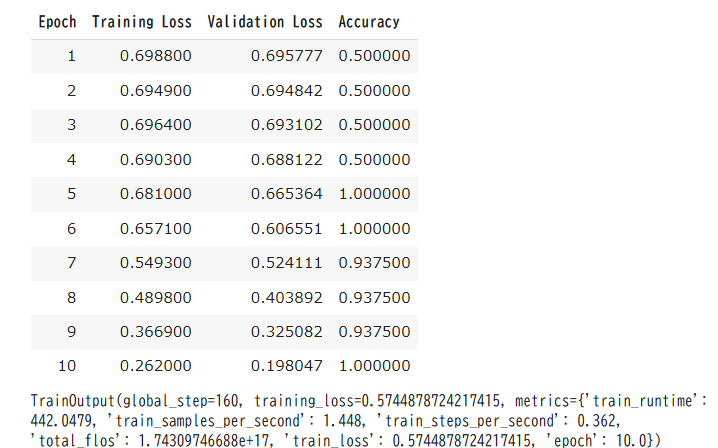

# 1.HuBERT

## (1)lr = 5e-5,epoch = 10

### 構造


```
HubertForSequenceClassification(
  (hubert): HubertModel(
    (feature_extractor): HubertFeatureEncoder(
      (conv_layers): ModuleList(
        (0): HubertGroupNormConvLayer(
          (conv): Conv1d(1, 512, kernel_size=(10,), stride=(5,), bias=False)
          (activation): GELUActivation()
          (layer_norm): GroupNorm(512, 512, eps=1e-05, affine=True)
        )
        (1-4): 4 x HubertNoLayerNormConvLayer(
          (conv): Conv1d(512, 512, kernel_size=(3,), stride=(2,), bias=False)
          (activation): GELUActivation()
        )
        (5-6): 2 x HubertNoLayerNormConvLayer(
          (conv): Conv1d(512, 512, kernel_size=(2,), stride=(2,), bias=False)
          (activation): GELUActivation()
        )
      )
    )
    (feature_projection): HubertFeatureProjection(
      (layer_norm): LayerNorm((512,), eps=1e-05, elementwise_affine=True)
      (projection): Linear(in_features=512, out_features=768, bias=True)
      (dropout): Dropout(p=0.0, inplace=False)
    )
    (encoder): HubertEncoder(
      (pos_conv_embed): HubertPositionalConvEmbedding(
        (conv): ParametrizedConv1d(
          768, 768, kernel_size=(128,), stride=(1,), padding=(64,), groups=16
          (parametrizations): ModuleDict(
            (weight): ParametrizationList(
              (0): _WeightNorm()
            )
          )
        )
        (padding): HubertSamePadLayer()
        (activation): GELUActivation()
      )
      (layer_norm): LayerNorm((768,), eps=1e-05, elementwise_affine=True)
      (dropout): Dropout(p=0.1, inplace=False)
      (layers): ModuleList(
        (0-11): 12 x HubertEncoderLayer(
          (attention): HubertSdpaAttention(
            (k_proj): Linear(in_features=768, out_features=768, bias=True)
            (v_proj): Linear(in_features=768, out_features=768, bias=True)
            (q_proj): Linear(in_features=768, out_features=768, bias=True)
            (out_proj): Linear(in_features=768, out_features=768, bias=True)
          )
          (dropout): Dropout(p=0.1, inplace=False)
          (layer_norm): LayerNorm((768,), eps=1e-05, elementwise_affine=True)
          (feed_forward): HubertFeedForward(
            (intermediate_dropout): Dropout(p=0.1, inplace=False)
            (intermediate_dense): Linear(in_features=768, out_features=3072, bias=True)
            (intermediate_act_fn): GELUActivation()
            (output_dense): Linear(in_features=3072, out_features=768, bias=True)
            (output_dropout): Dropout(p=0.1, inplace=False)
          )
          (final_layer_norm): LayerNorm((768,), eps=1e-05, elementwise_affine=True)
        )
      )
    )
  )
  (projector): Linear(in_features=768, out_features=256, bias=True)
  (classifier): Linear(in_features=256, out_features=2, bias=True)
)
```

### データセット


### エポック



### 実際の推論


## (2)lr = 5e-5,epoch = 20

### 構造


```
HubertForSequenceClassification(
  (hubert): HubertModel(
    (feature_extractor): HubertFeatureEncoder(
      (conv_layers): ModuleList(
        (0): HubertGroupNormConvLayer(
          (conv): Conv1d(1, 512, kernel_size=(10,), stride=(5,), bias=False)
          (activation): GELUActivation()
          (layer_norm): GroupNorm(512, 512, eps=1e-05, affine=True)
        )
        (1-4): 4 x HubertNoLayerNormConvLayer(
          (conv): Conv1d(512, 512, kernel_size=(3,), stride=(2,), bias=False)
          (activation): GELUActivation()
        )
        (5-6): 2 x HubertNoLayerNormConvLayer(
          (conv): Conv1d(512, 512, kernel_size=(2,), stride=(2,), bias=False)
          (activation): GELUActivation()
        )
      )
    )
    (feature_projection): HubertFeatureProjection(
      (layer_norm): LayerNorm((512,), eps=1e-05, elementwise_affine=True)
      (projection): Linear(in_features=512, out_features=768, bias=True)
      (dropout): Dropout(p=0.0, inplace=False)
    )
    (encoder): HubertEncoder(
      (pos_conv_embed): HubertPositionalConvEmbedding(
        (conv): ParametrizedConv1d(
          768, 768, kernel_size=(128,), stride=(1,), padding=(64,), groups=16
          (parametrizations): ModuleDict(
            (weight): ParametrizationList(
              (0): _WeightNorm()
            )
          )
        )
        (padding): HubertSamePadLayer()
        (activation): GELUActivation()
      )
      (layer_norm): LayerNorm((768,), eps=1e-05, elementwise_affine=True)
      (dropout): Dropout(p=0.1, inplace=False)
      (layers): ModuleList(
        (0-11): 12 x HubertEncoderLayer(
          (attention): HubertSdpaAttention(
            (k_proj): Linear(in_features=768, out_features=768, bias=True)
            (v_proj): Linear(in_features=768, out_features=768, bias=True)
            (q_proj): Linear(in_features=768, out_features=768, bias=True)
            (out_proj): Linear(in_features=768, out_features=768, bias=True)
          )
          (dropout): Dropout(p=0.1, inplace=False)
          (layer_norm): LayerNorm((768,), eps=1e-05, elementwise_affine=True)
          (feed_forward): HubertFeedForward(
            (intermediate_dropout): Dropout(p=0.1, inplace=False)
            (intermediate_dense): Linear(in_features=768, out_features=3072, bias=True)
            (intermediate_act_fn): GELUActivation()
            (output_dense): Linear(in_features=3072, out_features=768, bias=True)
            (output_dropout): Dropout(p=0.1, inplace=False)
          )
          (final_layer_norm): LayerNorm((768,), eps=1e-05, elementwise_affine=True)
        )
      )
    )
  )
  (projector): Linear(in_features=768, out_features=256, bias=True)
  (classifier): Linear(in_features=256, out_features=2, bias=True)
)
```
### データセット


### エポック


### 実際の推論


# HuBERT with CNN(mel log)の結果

## (1)sumかつepoch=10

### 構造

```
CNN Summary:
----------------------------------------------------------------
Layer (type)               Output Shape         Param #        
================================================================
Conv2d-1                   [-1, 32, 128, 2401]  320           
ReLU-2                     [-1, 32, 128, 2401]  0             
MaxPool2d-3                [-1, 32, 64, 1200]   0             
Conv2d-4                   [-1, 64, 64, 1200]   18,496        
ReLU-5                     [-1, 64, 64, 1200]   0             
MaxPool2d-6                [-1, 64, 32, 600]    0             
================================================================
Total params: 18,816
Trainable params: 18,816
Non-trainable params: 0
----------------------------------------------------------------

```

```
HuBERTWithLogMel(
  (hubert): HubertModel(
    (feature_extractor): HubertFeatureEncoder(
      (conv_layers): ModuleList(
        (0): HubertGroupNormConvLayer(
          (conv): Conv1d(1, 512, kernel_size=(10,), stride=(5,), bias=False)
          (activation): GELUActivation()
          (layer_norm): GroupNorm(512, 512, eps=1e-05, affine=True)
        )
        (1-4): 4 x HubertNoLayerNormConvLayer(
          (conv): Conv1d(512, 512, kernel_size=(3,), stride=(2,), bias=False)
          (activation): GELUActivation()
        )
        (5-6): 2 x HubertNoLayerNormConvLayer(
          (conv): Conv1d(512, 512, kernel_size=(2,), stride=(2,), bias=False)
          (activation): GELUActivation()
        )
      )
    )
    (feature_projection): HubertFeatureProjection(
      (layer_norm): LayerNorm((512,), eps=1e-05, elementwise_affine=True)
      (projection): Linear(in_features=512, out_features=768, bias=True)
      (dropout): Dropout(p=0.0, inplace=False)
    )
    (encoder): HubertEncoder(
      (pos_conv_embed): HubertPositionalConvEmbedding(
        (conv): ParametrizedConv1d(
          768, 768, kernel_size=(128,), stride=(1,), padding=(64,), groups=16
          (parametrizations): ModuleDict(
            (weight): ParametrizationList(
              (0): _WeightNorm()
            )
          )
        )
        (padding): HubertSamePadLayer()
        (activation): GELUActivation()
      )
      (layer_norm): LayerNorm((768,), eps=1e-05, elementwise_affine=True)
      (dropout): Dropout(p=0.1, inplace=False)
      (layers): ModuleList(
        (0-11): 12 x HubertEncoderLayer(
          (attention): HubertSdpaAttention(
            (k_proj): Linear(in_features=768, out_features=768, bias=True)
            (v_proj): Linear(in_features=768, out_features=768, bias=True)
            (q_proj): Linear(in_features=768, out_features=768, bias=True)
            (out_proj): Linear(in_features=768, out_features=768, bias=True)
          )
          (dropout): Dropout(p=0.1, inplace=False)
          (layer_norm): LayerNorm((768,), eps=1e-05, elementwise_affine=True)
          (feed_forward): HubertFeedForward(
            (intermediate_dropout): Dropout(p=0.1, inplace=False)
            (intermediate_dense): Linear(in_features=768, out_features=3072, bias=True)
            (intermediate_act_fn): GELUActivation()
            (output_dense): Linear(in_features=3072, out_features=768, bias=True)
            (output_dropout): Dropout(p=0.1, inplace=False)
          )
          (final_layer_norm): LayerNorm((768,), eps=1e-05, elementwise_affine=True)
        )
      )
    )
  )
  (cnn): Sequential(
    (0): Conv2d(1, 32, kernel_size=(3, 3), stride=(1, 1), padding=(1, 1))
    (1): ReLU()
    (2): MaxPool2d(kernel_size=2, stride=2, padding=0, dilation=1, ceil_mode=False)
    (3): Conv2d(32, 64, kernel_size=(3, 3), stride=(1, 1), padding=(1, 1))
    (4): ReLU()
    (5): MaxPool2d(kernel_size=2, stride=2, padding=0, dilation=1, ceil_mode=False)
  )
  (fc_mel): Linear(in_features=1228800, out_features=768, bias=True)
  (classifier): Linear(in_features=768, out_features=2, bias=True)
  (loss_fn): CrossEntropyLoss()
)
```

### データセット


### epoch


### 実際の推論


## (2)sumかつepoch=20

### epoch


### 実際の推論


## (2)cat

## (3)weighted sum