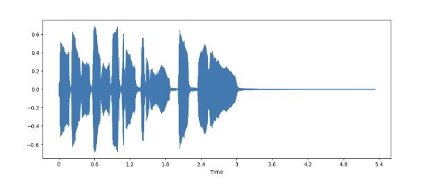
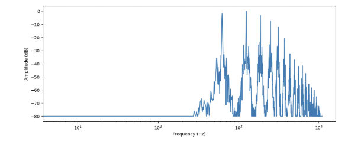
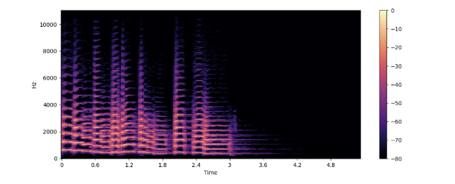
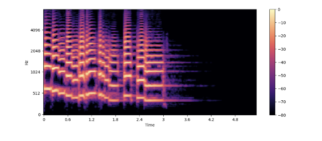
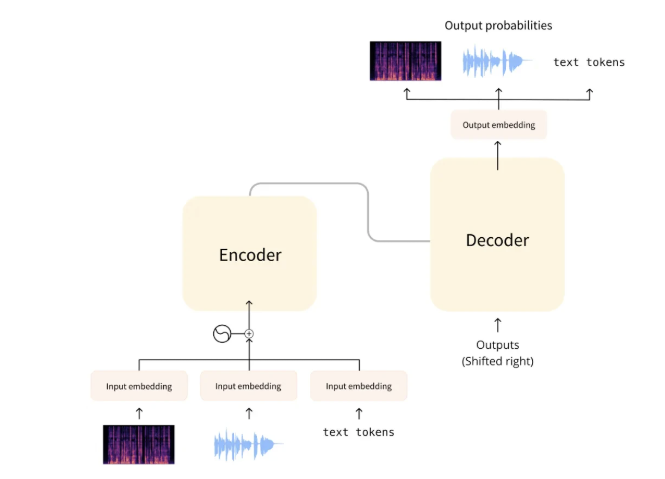

# Overview

このノートブックでは、事前に学習されたオーディオ用トランスフォーマーを使用して、オーディオ分類タスクを実行する手順を説明します。

音楽ジャンル分類（music genre classification）を行うためにトランスフォーマーモデルを微調整します。このモデルは音声録音を入力として受け取り、ジャンル（例：ポップやロック）としてラベル付けを行います。

始める前に、これらのファイルが実際に何を含んでいるのか、そしてどのように扱うのかを学びましょう。以下のような用語について説明します：

- 波形（waveform）
- サンプリングレート（sampling rate）
- スペクトログラム（spectrogram）

注記: データセット内のすべてのオーディオ例が同じサンプリングレートであることを確認することが重要です。

オーディオタスクを行う際、使用するデータのサンプリングレートはモデルが事前学習されたデータのサンプリングレートと一致する必要があります。

一致していない場合、 **リサンプリング（resampling）** の処理を行う必要があります。

## サンプリングレート（sampling rate）

サンプリングレートは連続するオーディオサンプル間の時間間隔を決定し、オーディオデータの時間的な解像度に影響を与えます。例えば、16,000 Hz のサンプリングレートで収録された5秒間の音声は、80,000の値として表現されます。

## 振幅（amplitude）

音の振幅は、任意の瞬間の音圧レベルを記述し、デシベル（dB）で測定されます。

また、**ビット深度（bit depth）** は、この振幅値をどの程度の精度で表現できるかを決定します。

# 波形としてのオーディオ（Auido as a waveform）

時間とともにサンプル値をプロットし、音の振幅の変化を視覚化できます。

この方法は、音を時間領域（time domain）で表現するものとして知られています。

この種類の視覚化は、オーディオ信号の個々の音声イベントのタイミング、信号全体の音量、またはオーディオ内の不規則性やノイズなど、特定の特徴を識別するために役立ちます。

```python
import librosa

array, sampling_rate = librosa.load(librosa.ex('trumpet'))
```

```python
import matplotlib.pyplot as plt
import librosa.display

plt.figure().set_figwidth(12)
librosa.display.waveshow(array, sr=sampling_rate)
```



これは、$y$ 軸に信号の振幅を、$x$ 軸に時間をプロットしたものです。

言い換えると、各点は、この音がサンプリングされたときに取得された単一のサンプル値に対応しています。

また、librosaはすでにオーディオを浮動小数点値として返すこと、そして振幅の値が実際に $[−1.0,1.0]$ の範囲内にあることにも注意してください。

# 周波数スペクトル（The frequency spectrum）

オーディオデータを視覚化するもう1つの方法は、オーディオ信号の **周波数スペクトル（frequency spectrum）をプロットすることです。これは周波数領域（frequency domain）** の表現としても知られています。

周波数スペクトルは、離散フーリエ変換（DFT）を使用して計算されます。

これにより、信号を構成する各周波数とその強度が説明されます。

ここでは、NumPyのrfft()関数を使用してDFTを取得することで、同じトランペット音の周波数スペクトルをプロットします。

音全体のスペクトルをプロットすることも可能ですが、代わりに特定の小さな領域を調べる方がより有用です。

ここでは、最初の4096サンプル（これは再生される最初の音符の長さにほぼ相当します）に対してDFTを取得します。

```python
import numpy as np

dft_input=array[:4096]

# calculate the DFT
window =np.hanning(len(dft_input))
windowed_input=dft_input*window
dft=np.fft.rfft(windowed_input)

# get the amplitude spectrum in decibels
amplitude=np.abs(dft)
amplitude_db=librosa.amplitude_to_db(amplitude, ref=np.max)

# get the frequency bins
frequency=librosa.fft_frequencies(sr=sampling_rate, n_fft=len(dft_input))

plt.figure().set_figwidth(12)
plt.plot(frequency, amplitude_db)
plt.xlabel('Frequency (Hz)')
plt.ylabel('Amplitude (dB)')
plt.xscale('log')
```



このプロットは、この音声セグメントに存在するさまざまな周波数成分の強さを示しています。

周波数の値は $x$ 軸にあり、通常は対数スケールでプロットされ、振幅は $y$ 軸にあります。

私たちがプロットした周波数スペクトルには、いくつかのピークが見られます。

これらのピークは、再生されている音符の高調波に対応しており、より高い高調波ほど音が静かになります。

# スペクトログラム

波形は時間に対する音声信号の振幅をプロットしますが、スペクトルは特定の時点で個々の周波数の振幅を可視化します。

では、音声信号内の周波数がどのように変化するかを確認したい場合はどうすればよいでしょうか？

問題は、スペクトルが特定の瞬間における周波数のスナップショットしか示さないことです。

これに対する解決策は、複数の離散フーリエ変換（DFT）を取得し、それぞれが短い時間範囲をカバーするようにし、得られたスペクトルを積み重ねてスペクトログラムにすることです。

この計算を行うアルゴリズムは、短時間フーリエ変換（STFT: Short Fourier Transform）と呼ばれます。

同じトランペット音に対してスペクトログラムをプロットしてみましょう。

```python
import numpy as np

D=librosa.stft(array)
S_db=librosa.amplitude_to_db(np.abs(D), ref=np.max)

plt.figure().set_figwidth(12)
librosa.display.specshow(S_db, x_axis='time', y_axis='hz')
plt.colorbar()
```



このプロットでは、x軸は波形の可視化と同様に時間を表していますが、y軸は周波数（単位：Hz）を表しています。色の強度は、各時点における周波数成分の振幅またはパワーを示しており、デシベル（dB）で測定されています。スペクトログラムは、数ミリ秒間持続する短い音声信号セグメントを取り出し、各セグメントの離散フーリエ変換を計算して周波数スペクトルを得ることで作成されます。得られたスペクトルは、時間軸に沿って積み重ねられ、スペクトログラムを生成します。この画像の各垂直スライスは、上から見た単一の周波数スペクトルに対応しています。

デフォルトでは、librosa.stft()は音声信号を2048サンプルのセグメントに分割し、周波数分解能と時間分解能のバランスが良いトレードオフを提供します。

スペクトログラムと波形は同じデータの異なる視点であるため、逆STFT（Short-Time Fourier Transform）を使用してスペクトログラムを元の波形に戻すことが可能です。

この場合、古典的なGriffin-Limアルゴリズムのような位相再構成アルゴリズムを使用するか、ベクターと呼ばれるニューラルネットワークを使用して、スペクトログラムから波形を再構築することができます。

# メルスペクトログラム

メルスペクトログラムは、スペクトログラムの一種で、音声処理や機械学習タスクで一般的に使用されます。これは、スペクトログラムに似ていますが、異なる周波数軸上で音声信号の周波数成分を表示するものです。

```python
S=librosa.feature.melspectrogram(y=array, sr=sampling_rate, n_mels=128, fmax=8000)
S_dB=librosa.power_to_db(S,ref=np.max)

plt.figure().set_figwidth(12)
librosa.display.specshow(S_dB, x_axis='time', y_axis='mel', sr=sampling_rate, fmax=8000)
plt.colorbar()
```



上記の例では、n_melは生成するメルバンドの数を表します。

メルバンドは、スペクトルを知覚的に意味のある要素に分割する一連の周波数範囲を定義しており、人間の耳が異なる周波数にどのように応答するかを模倣するように設計された形状と間隔を持つフィルターセットを使用します。

n_melsの一般的な値は40または80です。

fmaxは、対象とする最高周波数（単位：Hz）を示します。

# モデルの紹介

元のTransformerアーキテクチャはテキストデータを扱うよう設計されていましたが、現在では音声データを扱うためのアーキテクチャも数多く存在します。これらのモデルは、入力として使用する音声データの種類や、それらの内部動作における微妙な違いがあるかもしれません。しかし、全体としては、これらのモデルは元のTransformerのアプローチに非常によく似た方法を採用する傾向があります。



ここでは、HuBERTを使用します。

これはエンコーダのみのモデルで、音声分類のタスクに最適です。

主なアイデアは、入力音声の一部をマスクし、モデルがそのマスクされた部分をどのように予測するかを学習するように訓練されるというものです。

また、このモデルは**クラスタ・アンサンブル（cluster ensembles）**を使用して擬似ラベルを生成します。

この擬似ラベルは、マスクされた部分を予測する学習プロセスを導くのに役立ちます。

# データセット

今回使用するのは、GTZANデータセットです。このデータセットには、さまざまなジャンルの音楽から構成される、30秒間の長さの音声ファイルが500サンプル以上含まれています。

```python
import os
from huggingface_hub import login
from kaggle_secrets import UserSecretsClient
user_secrets = UserSecretsClient()

login(token=user_secrets.get_secret("HUGGINGFACE_TOKEN"))

os.environ['DATASET']='marsyas/gtzan'
os.environ['MODEL']='ntu-spml/distilhubert'

os.environ["WANDB_API_KEY"]=user_secrets.get_secret("WANDB_API_KEY")
os.environ["WANDB_PROJECT"] = "Fine-tuning HuBERT"
os.environ["WANDB_NOTES"] = "Fine-tuning HuBERT on gtzan"
os.environ["WANDB_NAME"] = "ft-hubert-on-gtzan"
```

# DistilHuBERT

ベースモデルは16kHzの音声サンプルデータで事前学習されています。このモデルを使用する場合は、音声入力も16kHzでサンプリングされていることを確認してください。

注記: このモデルにはトークナイザーが付属していません。これは音声データ単体で事前学習されているためです。このモデルを音声認識に使用するには、トークナイザーを作成し、ラベル付きテキストデータでファインチューニングを行う必要があります。

自己教師ありの音声表現学習手法（例: wav2vec 2.0およびHidden-unit BERT (HuBERT)）は、ラベルなしの音声データを利用して事前学習を行い、多くの音声処理タスクにおける優れた表現を提供します。

しかし、これらの手法の成功にもかかわらず、大量のメモリと高い事前学習コストが必要であるため、学術機関や小規模な企業の研究者にとっては利用が困難です。

そこで本論文では、HuBERTモデルから隠れた表現を直接蒸留する、新しいマルチタスク学習フレームワークであるDistilHuBERTを紹介します。

この手法により、HuBERTのサイズを75%削減し、学習速度を73%向上させつつ、10種類のタスクでほぼ同等のパフォーマンスを維持します

。さらに、DistilHuBERTは少ない学習時間とデータを必要とし、音声用の個人向けおよびデバイス上の自己教師あり学習（SSL）モデルの事前学習の可能性を広げます。

```python
kwargs={
    'dataset_tags': f'{os.getenv("DATASET")}',
    'dataset': 'GTZAN',
    'model_name': f'{os.getenv("WANDB_NAME")}',
    'finetuned_from': f'{os.getenv("MODEL")}',
    'tasks': 'audio-classification'
}

trainer.push_to_hub(**kwargs)
feature_extractor.push_to_hub(os.getenv('WANDB_NAME'))
```

このPythonコードは、モデルをHugging FaceのHubにアップロードするためのものです。以下に各部分を詳細に説明します。

## コードの解説

- kwargs

Hubにモデルをアップロードする際に、モデルに関するメタデータを渡すための辞書です。

各キーと値がアップロード時にモデルの説明や設定に使用されます。

```python
trainer.push_to_hub(**kwargs)
```

**trainer.push_to_hub**はモデルをHugging Face Hubにアップロードするためのメソッド。

モデルのトレーニング後に、kwargsで指定されたメタデータを付加してモデルをアップロードします。

```python
feature_extractor.push_to_hub(os.getenv('WANDB_NAME'))
```

モデルと一緒に使用される特徴量抽出器（Feature Extractor）をHugging Face Hubにアップロードします。

特徴量抽出器は、音声データをモデルが処理可能な形式に変換する役割を持ちます。

# 推論

```python
from transformers import pipeline

pipe=pipeline('audio-classification', model=f'aisuko/ft-hubert-on-gtzan')

pipe("https://huggingface.co/datasets/Narsil/asr_dummy/resolve/main/1.flac")
```

## コードの解説

```python
pipeline('audio-classification', ...)
```
ここでaudio-classificationというタスクが指定されています。

音声分類タスクでは、音声ファイルを入力として受け取り、その音声データが何を表しているか（例: 音楽ジャンル、話者の性別など）を分類します。

```python
model=f'aisuko/ft-hubert-on-gtzan'
```

Hugging Faceモデルハブに公開されているモデルaisuko/ft-hubert-on-gtzanを指定しています。

```python
pipe("https://huggingface.co/datasets/Narsil/asr_dummy/resolve/main/1.flac")
```

pipeに音声ファイル（1.flac）のURLを渡しています。